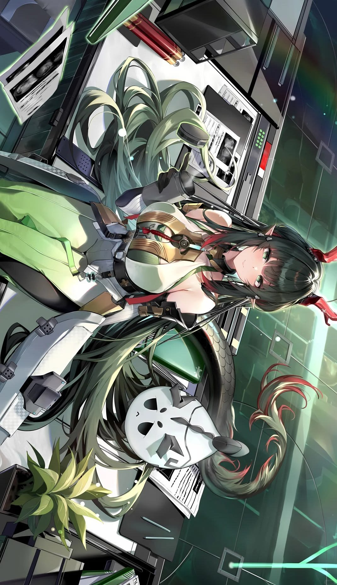

<!-- ============================== HEADER ============================== -->

<!-- ============================== TOP SECTION ============================== -->

### ◢ 識別 ／ IDENTIFY ◣

- 識別 ／ **CODENAME**: `Zerith` ◤ 終末より来た者 ◢

- 拠点 ／ **HOMEBASE**: 大韓民国 ／ Republic of Korea

- 任務 ／ **MISSION**: **웹 모의해킹 (Web Penetration Testing)** ＆ **CTF Player**

- 所属 ／ **AFFILIATION**: 보안 전공 ／ Information Security Major

- 信仰 ／ **LOYALTY**: [**Arknights : Endfield**](https://endfield.gryphline.com/)

 

<!-- ============================== STACK / WEAPONS ============================== -->

### ◢ 装備 ／ ARSENAL ◣

 

<!-- ============================== MID SECTION ============================== -->

### ◢ 戦闘記録 ／ COMBAT_LOG ◣

<!-- BLOG_RSS_START -->
- ⚡ ｜ `[Web]` ｜ HackTheBox - Pilgrimage Writeup
- ⚡ ｜ `[CTF]` ｜ Codegate 2026 - Web Quals Writeup
- ⚡ ｜ `[Web]` ｜ PicoCTF 2026 - Cookie Monster Writeup
- ⚡ ｜ `[Web]` ｜ DreamHack War Game - SimpleSQLi Writeup
- ⚡ ｜ `[Pentest]` ｜ Authentication Bypass 정리노트
- ⚡ ｜ `[Recon]` ｜ OSINT 자동화 스크립트 작성기
<!-- BLOG_RSS_END -->

 

### ◢ 統計 ／ STATS ◣

 

<!-- ============================== QUOTE ============================== -->

<!-- ============================== LINKS ============================== -->

<!-- ============================== BOTTOM BANNER ============================== -->

◤ <code>SYSTEM STATUS: ONLINE</code> ／ <code>システム稼働中</code> ◢ ／ <code>End of transmission ◢◤◢◤</code>

